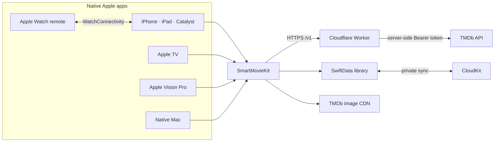

# SmartMovie 2.0 — Apple apps and catalog backend

[](https://github.com/LamPPKK/SmartMovie/actions/workflows/swift.yml)
[](https://github.com/LamPPKK/SmartMovie/actions/workflows/xcode-build-analyze.yml)
[](https://github.com/LamPPKK/SmartMovie/actions/workflows/ios.yml)
[](https://github.com/LamPPKK/SmartMovie/actions/workflows/worker.yml)

SmartMovie is a cinematic movie and TV catalog for the Apple ecosystem. Browse what is trending, explore by genre, search the catalog, watch trailers, and keep independent Favorite and Watchlist collections that remain available offline.

This repository contains the native SwiftUI apps for iPhone, iPad, Mac Catalyst, Apple TV, Apple Vision Pro, Apple Watch, and native macOS. It also owns the Cloudflare Worker and the canonical OpenAPI contract consumed by every SmartMovie client.

> [!NOTE]
> SmartMovie is a catalog and trailer app. It does not stream movies or TV episodes, require a SmartMovie account, display advertising, or offer in-app purchases.

> [!IMPORTANT]
> SmartMovie 2.0 is under active development. Source-level quality gates are in place; production domains, signing, the CloudKit production schema, final store artwork, and App Store metadata still require release-owner configuration.

## Two repositories, one SmartMovie 2.0

| Repository | Owns | Mobile release role |
| --- | --- | --- |
| **[SmartMovie](https://github.com/LamPPKK/SmartMovie)** (this repository) | SwiftUI Apple apps, `SmartMovieKit`, Cloudflare Worker, OpenAPI 3.1 contract, canonical fixtures | App Store source of truth and backend owner |
| **[Android.Smart.Movie](https://github.com/LamPPKK/Android.Smart.Movie)** | Native Android and Wear OS apps, Compose Multiplatform desktop/web app, versioned contract snapshot | Google Play source of truth |

The two native mobile apps keep platform-specific UI and storage while sharing the same `/v1` catalog behavior, six locales, semantic release train, error rules, and deterministic decoder fixtures. There is intentionally no cross-platform account or Favorite/Watchlist synchronization in 2.0.

## What you can do

- **Discover movies and TV series** from curated Home shelves for trending, popular, top-rated, now playing/on air, and upcoming titles.
- **Explore the catalog** with media type, genre, release year, rating, and sort controls plus deduplicated infinite pagination.
- **Search quickly** with debounced, cancellable requests and Movie, TV Series, or All scopes.
- **Open rich title details** with rating, release information, genres, synopsis, runtime or season count, cast, similar titles, and a language-aware YouTube trailer.
- **Build a private library** with separate Favorite and Watchlist actions. SwiftData keeps both readable offline; supported Apple apps can use the user's private CloudKit database.
- **Move between Apple devices naturally** with adaptive tabs or sidebars, keyboard and pointer support, focus-driven TV navigation, multi-window details on Mac/visionOS, and an Apple Watch companion remote.
- **Use the app in six languages**: English, Vietnamese, Japanese, Korean, Simplified Chinese, and Traditional Chinese.
- **Rely on accessible defaults** including Dynamic Type, VoiceOver labels, Increase Contrast, Reduce Motion, and platform-native focus behavior.

## Screenshots

### iPhone — Home and title detail

<table>
  <tr>
    <td width="50%" align="center"><strong>Discover</strong><br><sub>Movie/TV switch, featured title, and catalog shelves</sub></td>
    <td width="50%" align="center"><strong>Title detail</strong><br><sub>Trailer, library actions, story, cast, and similar titles</sub></td>
  </tr>
  <tr>
    <td align="center"></td>
    <td align="center"></td>
  </tr>
</table>

### iPad — adaptive catalog

The universal app expands shelves and content density on iPad while retaining the same Home, Explore, Search, and Library flow.

<p align="center">
  
</p>

### Apple TV and Apple Watch

<table>
  <tr>
    <td width="72%" align="center"><strong>Apple TV</strong><br><sub>10-foot catalog with focus and Siri Remote navigation</sub></td>
    <td width="28%" align="center"><strong>Apple Watch</strong><br><sub>Remote for the title open on the paired iPhone</sub></td>
  </tr>
  <tr>
    <td align="center"></td>
    <td align="center"></td>
  </tr>
</table>

Screenshots come from the real SwiftUI targets using deterministic local `/v1` preview data and original abstract artwork. They require neither a TMDb credential nor public network access. Native macOS and visionOS are built as first-class targets; their expanded navigation and multi-window behavior are covered by the platform matrix and Xcode quality gates below.

## Apple app matrix

| App / device | Minimum OS | Experience | Xcode scheme |
| --- | ---: | --- | --- |
| iPhone | iOS 17 | Four native tabs, compact cards, sheets, and full-screen title flow | `SmartMovie` |
| iPad | iPadOS 17 | Adaptive navigation, denser shelves, keyboard, and pointer support | `SmartMovie` |
| Mac Catalyst | macOS compatible with the iOS 17 target | Shared universal app with expanded navigation | `SmartMovie` |
| Apple TV | tvOS 17 | 10-foot layout, focus-driven shelves, Siri Remote/D-pad navigation, and trailer handoff | `SmartMovieTV` |
| Apple Vision Pro | visionOS 1 | Resizable catalog window and separate title-detail windows | `SmartMovieVision` |
| Apple Watch | watchOS 10 | Non-standalone WatchConnectivity companion remote | `SmartMovieWatch` |
| Native Mac | macOS 14 | `NavigationSplitView`, menu commands, keyboard shortcuts, and multi-window details | `SmartMovieNativeMac` |

The universal Apple product uses bundle ID `LamNDT.SmartMovie`, the embedded watch companion uses `LamNDT.SmartMovie.watchkitapp`, and the native Mac product uses `LamNDT.SmartMovie.NativeMac`. The catalog products share the private CloudKit container `iCloud.LamNDT.SmartMovie`.

## Architecture



`SmartMovieKit` contains domain models and repository protocols, the async/await API client, SwiftData library storage, observable feature state, localization, and shared SwiftUI components. App targets own lifecycle and platform adapters instead of duplicating product logic.

The Worker exposes exactly six allowlisted `/v1` route families: Home, Genres, Discover, Search, Title Detail, and Image Configuration. It owns the TMDb Bearer token, validates queries, normalizes errors, caches upstream responses, and rate-limits clients. The canonical OpenAPI 3.1 document and JSON fixtures live in `backend/worker/contract`.

The Android repository vendors that contract with a manifest containing its version, upstream commit, OpenAPI checksum, and fixture checksum. Production Worker promotion is blocked until Android `main` pins the same contract and release train; staging remains available for compatibility testing.

Read [Architecture](docs/ARCHITECTURE.md) for repository boundaries, synchronization rules, caching, and invariants.

## Repository layout

```text
SmartMovie/
├── SmartMovie/          # XcodeGen spec, Xcode project, app shells, entitlements, assets
├── SmartMovieKit/       # Shared Swift package, data/UI layers, localization, unit tests
├── backend/worker/      # TypeScript Cloudflare Worker, OpenAPI contract, fixtures, tests
├── release/             # Shared SmartMovie 2.0 release-train manifest
├── scripts/             # Read-only environment Doctor and release checks
├── docs/                # Architecture, testing, privacy, release operations, screenshots
└── .github/workflows/   # Swift, Xcode, simulator, contract, and Worker automation
```

## Getting started

### Requirements

- Full Xcode with the iOS, tvOS, watchOS, visionOS, and macOS SDKs
- XcodeGen 2.46 or newer
- SwiftLint
- Node.js 24 and npm for the Worker
- Apple silicon for visionOS builds and Simulator testing

Run the read-only environment check first:

```sh
./scripts/doctor.sh
```

If macOS points at Command Line Tools instead of full Xcode, select the installed Xcode toolchain before building:

```sh
sudo xcode-select --switch /Applications/Xcode.app/Contents/Developer
```

Clone, generate, and open the project:

```sh
git clone https://github.com/LamPPKK/SmartMovie.git
cd SmartMovie
xcodegen generate --spec SmartMovie/project.yml
open SmartMovie/SmartMovie.xcodeproj
```

Choose `SmartMovie`, `SmartMovieTV`, `SmartMovieVision`, `SmartMovieWatch`, or `SmartMovieNativeMac` and a compatible destination. `SmartMovie/project.yml` is the canonical Xcode project definition; regenerate the project whenever it changes.

### Run the catalog Worker locally

The apps never contain a TMDb credential. Debug uses `https://staging-catalog.smartmovie.app/` and Release uses `https://catalog.smartmovie.app/` after their Cloudflare DNS/TLS setup is complete.

```sh
cd backend/worker
npm ci
npx wrangler secret put TMDB_BEARER_TOKEN --env staging
npm run dev
```

Keep the TMDb Read Access Token in Wrangler secrets only. Never commit it to Swift, an `.xcconfig`, an environment file, logs, screenshots, or either client repository.

## Tests and quality gates

Run the local source gates from the repository root:

```sh
swiftlint lint --strict --no-cache
swift test --package-path SmartMovieKit --enable-code-coverage

cd backend/worker
npm ci
npm run check
npm test

cd ../..
./scripts/verify-release.sh
```

The current automated baseline contains 25 Swift tests and 28 Worker tests. Coverage includes canonical fixture decoding, unknown and missing nullable fields, success/error schema validation, retries, cancellation, pagination, and data-layer behavior without live TMDb, Cloudflare, CloudKit, or private credentials.

CI independently builds and analyzes iOS, iPad/Catalyst, tvOS, native macOS, watchOS, and visionOS, then installs and launches the iOS app in Simulator. Read [Testing](docs/TESTING.md) for destination-specific commands and the manual device matrix.

## Privacy and security

- TMDb authentication exists only in protected Cloudflare Worker secrets.
- The Worker rejects unknown routes, query fields, media types, languages, sort orders, and out-of-range values.
- Search text, credentials, raw client identifiers, and personal library data are not logged by design.
- Favorite and Watchlist records use local SwiftData and, where configured, the user's private CloudKit database.
- Watch remote messages stay between paired Apple devices.
- There is no SmartMovie account, analytics SDK, advertising SDK, or in-app purchase flow.

Read the [Privacy overview](docs/PRIVACY.md) before configuring production services.

## Release status

The shared release manifest pins SmartMovie `2.0.0`. Apple build numbers and Android version codes increase independently while both native apps remain on the same semantic release train.

Before App Store submission, the release owner must rotate any historical TMDb credential, activate both Worker domains, configure signing and the CloudKit production schema, add approved TMDb/platform artwork, publish support and privacy URLs, and complete platform-specific screenshots and metadata.

Follow the [Release runbook](docs/RELEASE_RUNBOOK.md) for staging smoke tests, TestFlight, production promotion, store submission, and rollback. [Release readiness](release/READINESS.md) separates automated gates from credentials, DNS, signing, artwork, and store-owner actions that cannot live in source control.

## Attribution

This product uses the TMDB API but is not endorsed or certified by TMDB. Movie and television metadata and artwork are supplied by [The Movie Database](https://www.themoviedb.org/).
