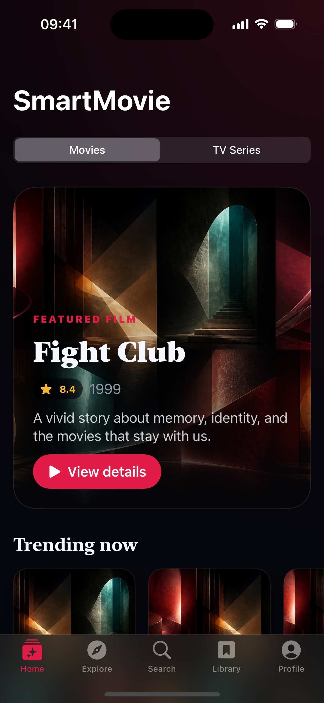
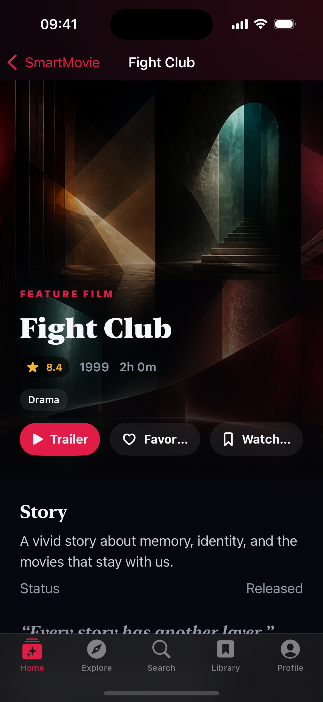
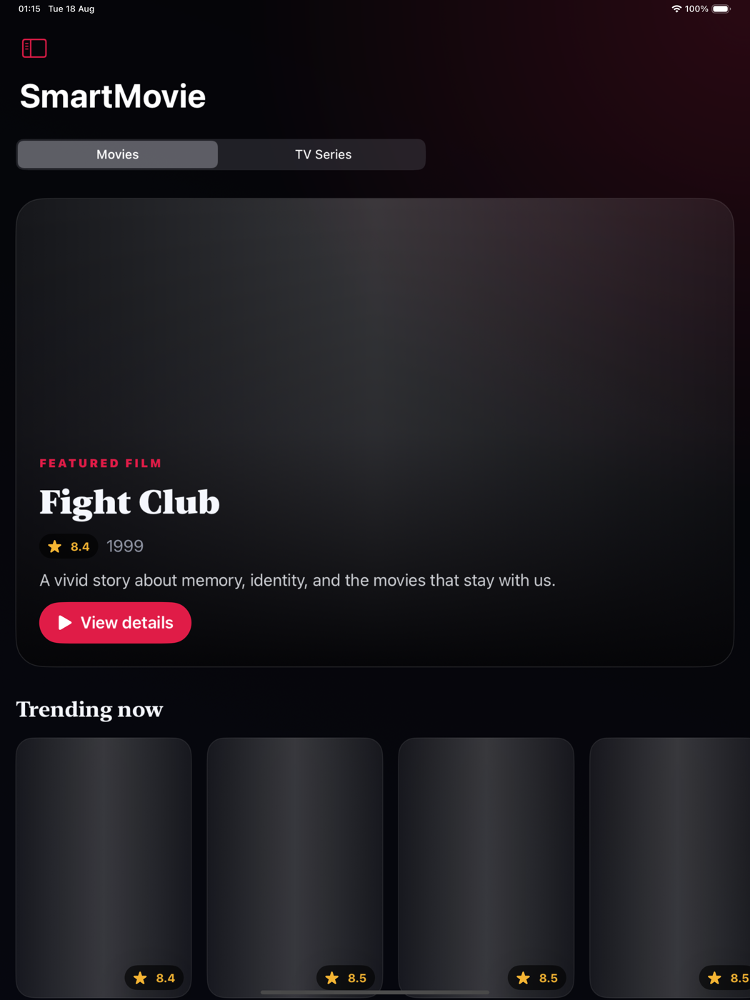
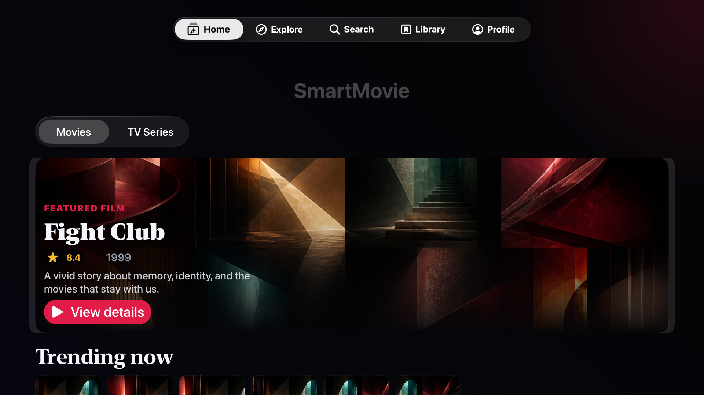
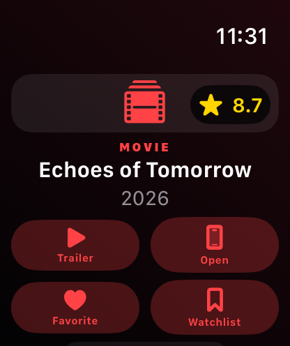
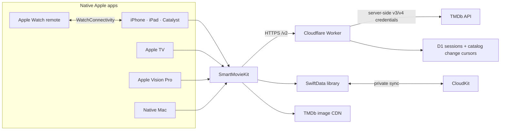

# Smart Movie iOS 3.0 — Apple apps and TMDb catalog backend

[](https://github.com/LamPPKK/Smart-Movie-iOS/actions/workflows/swift.yml)
[](https://github.com/LamPPKK/Smart-Movie-iOS/actions/workflows/xcode-build-analyze.yml)
[](https://github.com/LamPPKK/Smart-Movie-iOS/actions/workflows/ios.yml)
[](https://github.com/LamPPKK/Smart-Movie-iOS/actions/workflows/worker.yml)

SmartMovie is a cinematic TMDb catalog for the Apple ecosystem. It covers movies, television, people, collections, companies, networks, keywords, seasons, and episodes; adds region-aware availability and trailers; and can optionally synchronize library, ratings, recommendations, and mixed lists through a browser-approved TMDb account.

This repository contains the native SwiftUI apps for iPhone, iPad, Mac Catalyst, Apple TV, Apple Vision Pro, Apple Watch, and native macOS. It also owns the Cloudflare Worker and the canonical OpenAPI contract consumed by every SmartMovie client.

> [!NOTE]
> SmartMovie is a catalog and trailer app. It does not stream movies or episodes, create a separate SmartMovie identity, collect a TMDb password, display advertising, or offer in-app purchases.

> [!IMPORTANT]
> SmartMovie 3.0 is under active development. Source-level quality gates are in place; production D1/session secrets and callback domains, signing, the CloudKit production schema, final store artwork, privacy/support URLs, and App Store metadata still require release-owner configuration.

## Two repositories, one SmartMovie 3.0

| Repository | Owns | Mobile release role |
| --- | --- | --- |
| **[Smart Movie iOS](https://github.com/LamPPKK/Smart-Movie-iOS)** (this repository) | SwiftUI Apple apps, `SmartMovieKit`, Cloudflare Worker, OpenAPI 3.1 contract, canonical fixtures | App Store source of truth and backend owner |
| **[Smart Movie Android](https://github.com/LamPPKK/Smart-Movie-Android)** | Native Android and Wear OS apps, Compose Multiplatform desktop/web app, versioned contract snapshot | Google Play source of truth |

The two native mobile apps keep platform-specific UI and storage while sharing the additive `/v2` Worker contract, six locales, semantic release train, normalized errors, and deterministic decoder fixtures. `/v1` remains served for SmartMovie 2.0 compatibility. Account identity and content belong to TMDb; SmartMovie only brokers opaque sessions and maintains local-first caches/outboxes.

## What you can do

- **Explore a deep TMDb catalog** through curated Home feeds, advanced Discover filters, day/week trending, pagination, retry, and cancellation.
- **Search across entity types** with discriminated Movie, TV, Person, Collection, Company, and Keyword results, or resolve an IMDb, TheTVDB, Wikidata, Facebook, Instagram, or X/Twitter ID.
- **Open deep details** for titles, people, collections, organizations, keywords, TV seasons, episodes, and individual cast/crew credits, including navigable person/title links, role metadata, reviews, recommendations, and related titles.
- **Browse complete TMDb media** through deduplicated image galleries and every valid YouTube trailer, teaser, clip, or featurette on Movie/TV, Season, and Episode details; season/episode pages also expose air date, runtime, production code, votes, and external identifiers when supplied.
- **Read catalog reviews and follow recommendations** with full review bodies, blank/duplicate removal, localized author fallbacks, optional rating/date metadata, same-media-type TMDb recommendations, current-title exclusion, a separate similar-titles shelf, and adult-title filtering unless the local PIN is unlocked on Apple, Apple TV, and every full Android/KMP catalog client.
- **Understand every regional edition** through production-company/network links, region-matched certification and release date, alternative titles, localized translations, and external identifiers decoded by typed native models.
- **See where to watch** by device or chosen region for stream/rent/buy offers, with TMDb links and required JustWatch attribution.
- **Keep adult content private by default** with local age confirmation, a six-digit device PIN, and five-attempt lockout. The gate partitions Search, External ID, Title, Person, Collection, Company, Network, Keyword, Credit Detail, recommendations and similar titles; every client filters again before display, while companion and public surfaces never receive restricted titles.
- **Connect TMDb safely** through browser approval or TV QR without entering a password in SmartMovie. Browse paginated Movie/TV account recommendations, rate Movie/TV/Episode titles, and manage account library/lists with durable offline mutation retry.
- **Manage mixed custom lists** by loading every list page, editing metadata, paging through Movie/TV contents, searching the catalog, and adding or removing titles with restart-safe optimistic synchronization.
- **Build a local-first library** with independent Favorite and Watchlist actions. SwiftData keeps both readable offline; private CloudKit remains an Apple storage option.
- **Move between Apple devices naturally** with five adaptive destinations, keyboard/pointer support, focus-driven TV navigation, multi-window Mac/visionOS details, and an Apple Watch companion that mirrors a safe title or exact episode and opens it back on iPhone.
- **Use the app in six languages**: English, Vietnamese, Japanese, Korean, Simplified Chinese, and Traditional Chinese.
- **Rely on accessible defaults** including Dynamic Type, VoiceOver labels, Increase Contrast, Reduce Motion, and platform-native focus behavior.

## Screenshots

### iPhone — Home and title detail

<table>
  <tr>
    <td width="50%" align="center"><strong>Discover</strong><br><sub>Movie/TV switch, featured title, and catalog shelves</sub></td>
    <td width="50%" align="center"><strong>Title detail</strong><br><sub>Trailer, library actions, story, cast, and similar titles</sub></td>
  </tr>
  <tr>
    <td align="center"></td>
    <td align="center"></td>
  </tr>
</table>

### iPad — adaptive catalog

The universal app expands shelves and content density on iPad while retaining the same Home, Explore, Search, Library, and Profile flow.

<p align="center">
  
</p>

### Apple TV and Apple Watch

<table>
  <tr>
    <td width="72%" align="center"><strong>Apple TV</strong><br><sub>10-foot catalog with focus and Siri Remote navigation</sub></td>
    <td width="28%" align="center"><strong>Apple Watch</strong><br><sub>Safe title/episode context with exact-detail iPhone handoff</sub></td>
  </tr>
  <tr>
    <td align="center"></td>
    <td align="center"></td>
  </tr>
</table>

Screenshots come from the real SwiftUI targets using deterministic local fixtures and original abstract artwork. They require neither a TMDb credential nor public network access. Adult content and account credentials are excluded. The checked-in gallery currently covers iPhone, iPad, Apple TV, and Apple Watch; final Mac Catalyst, native macOS, and visionOS captures remain release assets and must be added before store publication.

## Apple app matrix

| App / device | Minimum OS | Experience | Xcode scheme |
| --- | ---: | --- | --- |
| iPhone | iOS 17 | Five native destinations, compact cards, browser-approved account flow, and full-screen entity details | `SmartMovie` |
| iPad | iPadOS 17 | Adaptive navigation, denser shelves, keyboard, and pointer support | `SmartMovie` |
| Mac Catalyst | macOS compatible with the iOS 17 target | Shared universal app with expanded navigation | `SmartMovie` |
| Apple TV | tvOS 17 | 10-foot layout, focus-driven shelves, Siri Remote/D-pad navigation, and trailer handoff | `SmartMovieTV` |
| Apple Vision Pro | visionOS 1 | Resizable catalog window and separate title-detail windows | `SmartMovieVision` |
| Apple Watch | watchOS 10 | Non-standalone WatchConnectivity companion for safe title/episode context and phone handoff | `SmartMovieWatch` |
| Native Mac | macOS 14 | `NavigationSplitView`, menu commands, keyboard shortcuts, and multi-window details | `SmartMovieNativeMac` |

The universal Apple product uses bundle ID `LamNDT.SmartMovie`, the embedded watch companion uses `LamNDT.SmartMovie.watchkitapp`, and the native Mac product uses `LamNDT.SmartMovie.NativeMac`. The catalog products share the private CloudKit container `iCloud.LamNDT.SmartMovie`.

## Architecture



`SmartMovieKit` contains discriminated domain models and repository protocols, async/await catalog/account clients, SwiftData storage, durable library/account outboxes, observable feature state, localization, and shared SwiftUI components. App targets own lifecycle and platform adapters instead of duplicating product logic.

The Worker serves the legacy six-route `/v1` catalog and the additive `/v2` catalog/account surface. `/v2` adds capabilities, entity search/detail, seasons/episodes, related title resources, regional providers, browser/TV authorization, profile/library state, ratings, recommendations, and custom lists. It owns TMDb credentials, validates queries and callbacks, normalizes errors, partitions public cache entries, rate-limits clients, and polls TMDb Movie/TV/Person change lists on an hourly cron. D1 stores encrypted session material, mutation-idempotency records, and non-personal catalog change cursors/revisions; changed entity revisions rotate the Cache API key for title, person, related-resource, season, and episode responses without exposing a debug route. Canonical OpenAPI 3.1 documents and fixtures live in `backend/worker/contract`.

The Android repository vendors that contract with a manifest containing its version, canonical source commit, OpenAPI checksum, fixture checksum, and frozen `/v1` version. The sync workflow resolves the most recent commit that actually changed the contract or release train, then compares the generated snapshot with public Android `main`; an already-matching snapshot completes without cross-repository credentials, while a real diff requires the least-privilege PR token. Production Worker promotion is blocked until Android `main` pins the same contract and release train; staging remains available for compatibility testing.

Read [Architecture](docs/ARCHITECTURE.md) for repository boundaries, synchronization rules, caching, and invariants.

## Repository layout

```text
SmartMovie/
├── SmartMovie/          # XcodeGen spec, Xcode project, app shells, entitlements, assets
├── SmartMovieKit/       # Shared Swift package, data/UI layers, localization, unit tests
├── backend/worker/      # TypeScript Cloudflare Worker, OpenAPI contract, fixtures, tests
├── release/             # Shared SmartMovie 3.0 release-train manifest
├── scripts/             # Read-only environment Doctor and release checks
├── docs/                # Architecture, testing, privacy, release operations, screenshots
└── .github/workflows/   # Swift, Xcode, simulator, contract, and Worker automation
```

## Getting started

### Requirements

- Full Xcode with the iOS, tvOS, watchOS, visionOS, and macOS SDKs
- XcodeGen 2.46 or newer
- SwiftLint
- Node.js 24 and npm for the Worker
- Apple silicon for visionOS builds and Simulator testing

Run the read-only environment check first:

```sh
./scripts/doctor.sh
```

If macOS points at Command Line Tools instead of full Xcode, select the installed Xcode toolchain before building:

```sh
sudo xcode-select --switch /Applications/Xcode.app/Contents/Developer
```

Clone, generate, and open the project:

```sh
git clone https://github.com/LamPPKK/Smart-Movie-iOS.git
cd Smart-Movie-iOS
xcodegen generate --spec SmartMovie/project.yml
open SmartMovie/SmartMovie.xcodeproj
```

Choose `SmartMovie`, `SmartMovieTV`, `SmartMovieVision`, `SmartMovieWatch`, or `SmartMovieNativeMac` and a compatible destination. `SmartMovie/project.yml` is the canonical Xcode project definition; regenerate the project whenever it changes.

### Run the catalog Worker locally

The apps never contain a TMDb credential. Debug uses `https://staging-catalog.smartmovie.app/` and Release uses `https://catalog.smartmovie.app/` after their Cloudflare DNS/TLS setup is complete.

```sh
cd backend/worker
npm ci
npx wrangler secret put TMDB_BEARER_TOKEN --env staging
npx wrangler secret put SESSION_ENCRYPTION_KEY --env staging
npx wrangler d1 migrations apply <auth-database-name> --env staging --remote
npm run dev
```

The account capability stays disabled unless the environment has its D1 binding, session-encryption secret, callback origin, and return-URI allowlist. Keep all TMDb and session secrets in Wrangler services only. Never commit them to Swift, an `.xcconfig`, an environment file, logs, screenshots, fixtures, or either client repository.

## Tests and quality gates

Run the local source gates from the repository root:

```sh
swiftlint lint --strict --no-cache
swift test --package-path SmartMovieKit --enable-code-coverage

cd backend/worker
npm ci
npm run check
npm run check:migrations
npm test

cd ../..
./scripts/verify-release.sh
```

The current verified local baseline contains 67 Swift tests, 98 Worker unit/contract tests, and 9 protected-account smoke-runner tests. Coverage includes canonical `/v1` and `/v2` fixture decoding, deterministic catalog-review and recommendation presentation, non-empty editorial and Movie/TV/Season/Episode media fixtures, image/video/external-ID presentation, numeric TMDb Season/Episode external-ID normalization, typed regional release/content-rating, Movie/TV alternative-title and translation metadata, configured capability/fixture equality, fail-closed browser/TV account rollout, malformed broker configuration and return-URI allowlists, cold-start callback deferral, stale completion invalidation, durable outbox isolation, capability-gated Advanced Discover and Profile provider regions with a fail-closed `/v1` fallback, complete Movie/TV Discover queries and regional provider configuration, External ID and Credit Detail source/path mapping, account recommendations, normalized/paginated custom mixed lists, restart-safe pending item snapshots, explicit adult age confirmation, six-digit PIN validation, five-attempt lockout, Worker partitioning plus client-side fail-closed filtering for every entity-related title/credit surface, local adult filtering and in-flight request invalidation, metadata/item mutations, normalized person/title credit links, exact episode companion context, unknown and missing nullable fields, success/error schema validation, repeatable D1 migrations, encryption/callback/CSRF controls, durable idempotency, TMDb Changes pagination/backlog recovery, invalid cursor recovery, verified changing-page-count fallback, D1 parameter-bound chunking, monotonic revision and cache-bypass behavior, retries, cancellation, pagination, and data behavior without live personal credentials. The protected staging runner additionally exercises all Movie/TV Favorite and Watchlist combinations, Movie/TV/Episode ratings, both recommendation feeds, canonical list-ID replay after a lost response, the complete mixed-list lifecycle through verified deletion, stable idempotency keys across 429/5xx/`mutation_in_progress` retry, private cache headers on success and error responses, one Worker version, and exact restoration after success or failure.

CI independently builds and analyzes iOS, iPad/Catalyst, tvOS, native macOS, watchOS, and visionOS, then installs and launches the iOS app in Simulator. Read [Testing](docs/TESTING.md) for destination-specific commands and the manual device matrix.

## Privacy and security

- TMDb application credentials and encrypted upstream account tokens exist only in protected Worker services.
- The Worker rejects unknown routes, query fields, media types, languages, sort orders, and out-of-range values.
- Search text, credentials, session tokens, PINs, raw client identifiers, and personal library data are not logged by design.
- Optional account approval happens on TMDb. Clients retain only an opaque broker token; Web receives a secure `HttpOnly` cookie.
- Favorite, Watchlist, rating, and list mutations are local-first and persist in durable outboxes until the Worker acknowledges the same idempotency key.
- Watch remote messages stay between paired Apple devices.
- There is no separate SmartMovie identity, analytics SDK, advertising SDK, or in-app purchase flow.

Read the [Privacy overview](docs/PRIVACY.md) before configuring production services.

## Release status

The shared release manifest pins SmartMovie `3.0.0` and contract `2.0.0`. Apple build numbers and Android version codes increase independently while Apple, Android, TV, watch companion, desktop JVM, JavaScript, and Wasm remain on the same semantic release train.

Before App Store submission, the release owner must rotate any historical TMDb credential, activate both Worker domains, configure signing and the CloudKit production schema, add approved TMDb/platform artwork, publish support and privacy URLs, and complete platform-specific screenshots and metadata.

Follow the [Release runbook](docs/RELEASE_RUNBOOK.md) for staging smoke tests, protected account tests, TestFlight, production promotion, store submission, and rollback. [TMDb coverage](docs/TMDB_COVERAGE.md) records product blockers; [Release readiness](release/READINESS.md) separates automated gates from credentials, DNS, signing, artwork, and store-owner actions that cannot live in source control.

## Attribution

This product uses the TMDB API but is not endorsed or certified by TMDB. Movie and television metadata and artwork are supplied by [The Movie Database](https://www.themoviedb.org/). Availability data is supplied by JustWatch through TMDb and is attributed wherever shown.
