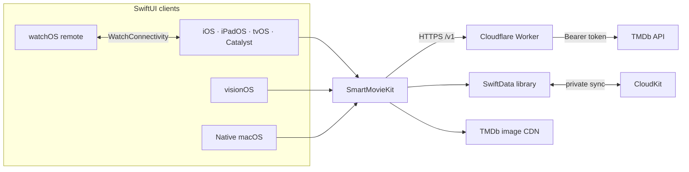

# SmartMovie 2.0

[](https://github.com/LamPPKK/SmartMovie/actions/workflows/swift.yml)
[](https://github.com/LamPPKK/SmartMovie/actions/workflows/xcode-build-analyze.yml)
[](https://github.com/LamPPKK/SmartMovie/actions/workflows/ios.yml)

A cinematic Movie and TV Series catalog built with SwiftUI for the Apple ecosystem. SmartMovie combines discovery, search, rich title details, trailers, and an offline-friendly personal library in a free, ad-free experience.

The same shared core powers iPhone, iPad, Apple TV, Apple Vision Pro, Mac Catalyst, and native macOS. Apple Watch acts as a companion remote for the title open on the paired iPhone.

> [!IMPORTANT]
> SmartMovie 2.0 is under active development. The source and automated checks are in place, but production Worker domains, signing, CloudKit production schema, final brand assets, and App Store metadata still need release-owner configuration.

## Screenshots

<table>
  <tr>
    <th>Home</th>
    <th>Title details</th>
    <th>Apple Watch remote</th>
  </tr>
  <tr>
    <td></td>
    <td></td>
    <td></td>
  </tr>
</table>

Screenshots were captured from the real SwiftUI app with deterministic preview metadata and original abstract artwork, so they do not require a TMDb token or public network access.

## Highlights

- **One catalog for Movies and TV Series** — Home, Explore, Search, and Library share a single media model while preserving type-specific metadata.
- **Cinematic, adaptive interface** — dark surfaces, artwork-led layouts, subtle motion, Dynamic Type, VoiceOver, Increase Contrast, and Reduce Motion support.
- **Fast discovery** — trending, popular, top-rated, currently airing/playing, upcoming, filters, sorting, infinite pagination, and cancellable debounced search.
- **Rich details** — backdrop, poster, rating, genres, synopsis, runtime or seasons, cast, similar titles, and language-aware trailer selection.
- **Private personal library** — Favorite and Watchlist are independent, remain readable offline in SwiftData, and sync through the user's private CloudKit database.
- **Companion and spatial experiences** — Apple Watch can open details, start a trailer, and update the library; visionOS supports resizable catalog and detail windows.
- **Protected catalog API** — a Cloudflare Worker owns the TMDb Bearer token, validates every route/query, normalizes errors, caches responses, and rate-limits clients.
- **Six localizations** — English, Vietnamese, Japanese, Korean, Simplified Chinese, and Traditional Chinese.

SmartMovie is a catalog and trailer app. It does not stream movies or television episodes, provide a TMDb login, show advertising, or contain in-app purchases.

## Platform matrix

| Platform | Minimum version | Experience | Scheme |
| --- | ---: | --- | --- |
| iPhone and iPad | iOS/iPadOS 17 | Four-tab navigation on iPhone; adaptive sidebar, pointer, and keyboard support on iPad | `SmartMovie` |
| Mac Catalyst | macOS compatible with the iOS 17 target | Shared universal app with adaptive sidebar | `SmartMovie` |
| Apple TV | tvOS 17 | Focus-driven shelves, cards, Remote-friendly navigation, and YouTube handoff | `SmartMovieTV` |
| Apple Vision Pro | visionOS 1 | Resizable catalog window and separate title-detail windows | `SmartMovieVision` |
| Apple Watch | watchOS 10 | Companion remote over WatchConnectivity | `SmartMovieWatch` |
| Native Mac | macOS 14 | `NavigationSplitView`, menu commands, keyboard shortcuts, and multi-window details | `SmartMovieNativeMac` |

The universal product uses bundle ID `LamNDT.SmartMovie`; the embedded Watch companion uses `LamNDT.SmartMovie.watchkitapp`. The separately listed native Mac product uses `LamNDT.SmartMovie.NativeMac`. Both catalog products share the private CloudKit container `iCloud.LamNDT.SmartMovie`.

## Architecture



`SmartMovieKit` contains domain models and repository protocols, the async/await API client, SwiftData library storage, observable feature state, localization, and shared SwiftUI components. Each application target owns only its lifecycle and platform adapter.

The Worker-owned OpenAPI 3.1 document and deterministic fixtures under `backend/worker/contract` are the catalog source of truth. Swift decodes them directly in conformance tests; the Android repository vendors a checksummed snapshot and production Worker promotion is blocked until Android `main` pins the same OpenAPI checksum, fixture checksum, contract version, and release train.

The Worker exposes an allowlisted `/v1` surface for Home, Discover, Search, Details, Genres, and image configuration. Search responses are cached for 5 minutes, Home and Discover for 15 minutes, Details for 1 hour, and Genres/Configuration for 24 hours. The default limit is 120 requests per minute per client identity.

See [Architecture](docs/ARCHITECTURE.md) for the repository contracts, synchronization rules, and invariants.

## Repository layout

```text
SmartMovie/
├── SmartMovie/          # XcodeGen spec, Xcode project, app shells, entitlements, assets
├── SmartMovieKit/       # Shared Swift package, UI, data layer, localization, unit tests
├── backend/worker/      # TypeScript Cloudflare Worker and contract tests
├── release/             # Shared 2.0 release-train manifest
├── scripts/             # Read-only Doctor and release consistency checks
├── docs/                # Architecture, testing, privacy, release operations, screenshots
└── .github/workflows/   # Swift, Xcode build/analyze, and iOS Simulator CI
```

## Getting started

### Requirements

- Xcode with the iOS, tvOS, watchOS, visionOS, and macOS SDKs
- XcodeGen 2.46 or newer
- SwiftLint
- Node.js 24 and npm
- Apple silicon for visionOS builds and Simulator testing

Select the complete Xcode toolchain if the machine currently points to Command Line Tools:

```sh
sudo xcode-select --switch /Applications/Xcode.app/Contents/Developer
```

Run `./scripts/doctor.sh` to verify Xcode, Swift 6, XcodeGen, SwiftLint, Node 24, and npm without changing the machine.

Clone and generate the project:

```sh
git clone https://github.com/LamPPKK/SmartMovie.git
cd SmartMovie
xcodegen generate --spec SmartMovie/project.yml
open SmartMovie/SmartMovie.xcodeproj
```

Choose one of the shared schemes in Xcode and run it on a compatible destination. Regenerate the project whenever `SmartMovie/project.yml` changes; the YAML file is the canonical project definition.

### Configure the catalog service

The app never contains a TMDb credential. Debug points to the staging custom domain `https://staging-catalog.smartmovie.app/`, while Release points to `https://catalog.smartmovie.app/`. Both hostnames are declared in Wrangler and must have active Cloudflare DNS/TLS before release.

To use another Worker, update `CATALOG_BASE_URL` in `SmartMovie/project.yml` and regenerate the Xcode project. To run the Worker locally:

```sh
cd backend/worker
npm ci
npx wrangler secret put TMDB_BEARER_TOKEN --env staging
npm run dev
```

Keep the TMDb Read Access Token in Wrangler secrets only. Never add it to Swift source, an `.xcconfig`, a checked-in environment file, logs, or screenshots.

## Tests and quality gates

Run the same core checks used by CI from the repository root:

```sh
swiftlint lint --strict --no-cache
swift test --package-path SmartMovieKit --enable-code-coverage

cd backend/worker
npm ci
npm run check
npm test

cd ../..
./scripts/verify-release.sh
```

The consolidated baseline is 25 Swift tests and 28 Worker tests, including canonical fixture decoding and OpenAPI schema validation. CI also builds and analyzes iOS, Mac Catalyst, tvOS, native macOS, watchOS, and visionOS independently, then installs and launches the iOS app in Simulator as a smoke test.

SwiftLint is enforced in strict mode. New behavior should include deterministic tests and must not depend on live TMDb, Cloudflare, CloudKit, wall-clock delays, or private credentials.

See [Testing](docs/TESTING.md) for coverage measurement, destination-specific build commands, and the manual platform matrix.

## Privacy and security

- TMDb authentication exists only in Cloudflare Worker secrets.
- The Worker rejects unknown routes, query fields, media types, languages, sort orders, and out-of-range values.
- Search text, tokens, raw client identifiers, and personal library data are not logged by design.
- Favorite and Watchlist records use the user's private CloudKit database; Watch remote payloads remain between paired devices.
- There is no SmartMovie account, advertising SDK, analytics SDK, or in-app purchase flow.

Read the [Privacy overview](docs/PRIVACY.md) before configuring production services.

## Release status

Before App Store submission, the release owner must rotate any historical TMDb credential, activate the Worker custom domains, run the protected staging-to-production Worker workflow, configure signing and CloudKit, add approved TMDb and platform artwork, publish support/privacy URLs, and complete platform-specific metadata and screenshots.

Follow the [Release runbook](docs/RELEASE_RUNBOOK.md) for the staging, CloudKit, production, TestFlight, and App Review sequence. [Release readiness](release/READINESS.md) separates automated source gates from credentials, DNS, artwork, and store-owner actions that cannot live in the repository.

## Attribution

This product uses the TMDB API but is not endorsed or certified by TMDB. Movie metadata and artwork are supplied by [The Movie Database](https://www.themoviedb.org/).
